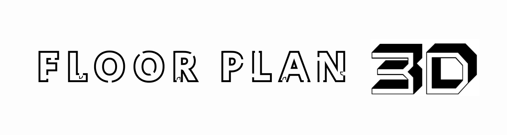

# Floorplan 3D - An MSc Computer Science (Conversion) final project

**A Desktop Application to turn architectural floorplans into 3D models**

This is a desktop application which generates 3D models from building plans. It is written using Electron.js for the front-end and Node.js for the back-end, which spawns Python processes for image manipulation and 3D model creation.

The application includes:
+ The ability to import images from the user’s file system.
+ A series of image preprocessing steps to remove noise, crop and correct perspective.
+ A novel wall detection algorithm.
+ The ability to detect doors and windows and an algorithm to differentiate between them.
+ A script that generates a 3D model from the detected features.
+ An interactive 3D model viewer.
+ The ability to export the model for use in 3D modelling software.
+ Several mechanisms for user intervention to correct any inaccuracies of the detection algorithms.
+ A graphical user interface.

**Note: It is currently only distributed for Mac OS 10.12 or later.**
